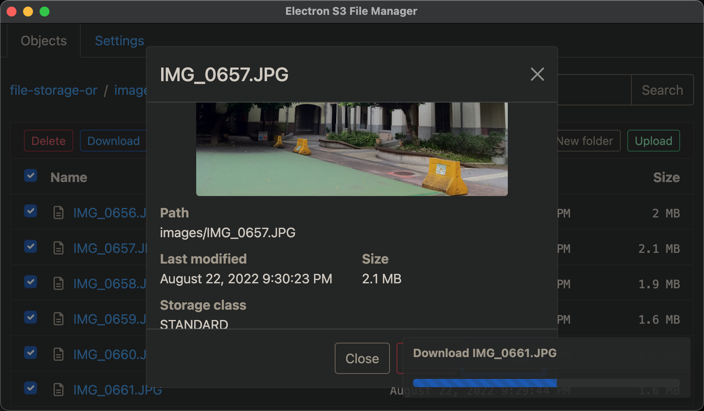

# electron-s3-file-manager
A GUI AWS S3 file manager. It supports keyword search, download, upload and preview video.




## Installation
[Go to release page.](https://github.com/kelp404/electron-s3-file-manager/releases)


## Development
### Run in development mode
```bash
git clone https://github.com/kelp404/electron-s3-file-manager.git
cd electron-s3-file-manager
npm install
npm start
```

### Generate dark theme stylesheet
#### 1. Disable dark mode.
Remove `utils.loadStylesheet('dark-theme.css');` at `render-process/index.js`.

#### 2. Add darkreader at `renderer-process/index.js`.
```js
const darkreader = require('darkreader');

darkreader.enable({
	brightness: 100,
	contrast: 90,
	sepia: 10,
});
darkreader.exportGeneratedCSS().then(console.log);
```

### Make database schema migration
#### 1. Update models at `src/main-process/models/data/*.js`
#### 2. Make migration script
```bash
npm run makemigration
```

### Run database schema migration scripts
```bash
npm run runmigration
```
